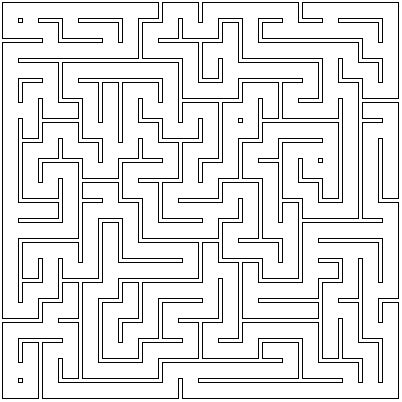

# MazeGen
Exploring the possibilities of a simple maze generation. 

Primarily, scripts are Python adaptation of code from a book [Mazes for Programmers](http://www.mazesforprogrammers.com/) .
Highly recommend this book if  you want to know about basics of maze creation.

This repository has folder _Scripts_ , which has a dozen algorithms for maze creation. They are:

- Binary Tree
- Sidewinder
- Aldous-Broder
- Wilsons
- Hunt and Kill
- Recursive Backtracker
- Dijkstra
- Kruskals
- Prims
- Growing Tree
- Ellers
- Recursive Division

The main script file `grid.py` introduces basic classes for cell and grid , essential for maze creation.
There is also `ColoredGrid` - special class, that using Dijkstra algorithm to represent maze texture.

Dijkstra algorithn is implemented and universal way to find solution to created maze. It also can find longest path in labirynth, which is useful for creating start/exit points.

All created mazes do not have start and exit. Their implementation is not responsibility of the algoritms.

Besided scripts to create mazes using algorithms, there are scripts to create differrent shapes of mazes :

1. Circle mazes using polar grids
2. Mazes created using text or image masks
3. Mazes with hexagon shaped cell
4. Triangle-cell mazes
5. Labirynth with passages weaving between itself
6. 3D mazes

If you interested in step by step instruction, i again recommend buying the book, or if you know Russian, read  my [blog posts](https://progrunmyst.ru/post/2024/10/1/osnovy-sozdaniya-labirintov-chast-1-dva-prostyh-metoda/)
